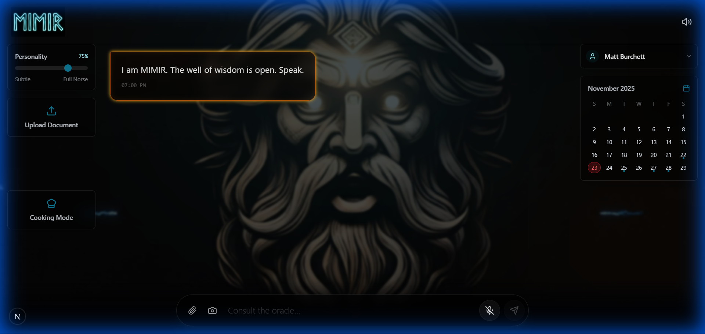
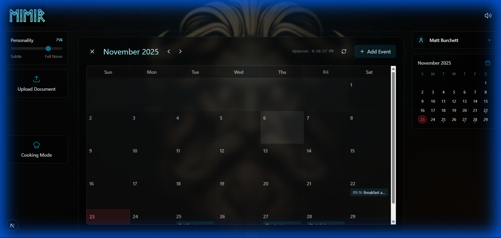

# MIMIR - The Wise

MIMIR is a sophisticated AI assistant embodying the wisdom and persona of the Norse god Mimir. Built with a modern tech stack, it features a powerful conversational engine, long-term memory, voice interaction, and practical tools for daily life. Now available as a Progressive Web App (PWA) for seamless mobile use.

## New Features (v2.0)

- **📱 Mobile PWA**: Install MIMIR on your phone for a native app-like experience. Features a touch-optimized UI, swipe gestures, and responsive layouts.
- **🍳 Enhanced Cooking Mode**: A reimagined cooking experience for mobile with a focused stack layout, swipeable ingredients, and large-text step navigation.
- **📔 AI Journal**: An intelligent diary that logs your life, analyzes your days, and helps you recall memories.

## Core Capabilities

- **🧠 Deep Wisdom (AI)**: Powered by Google's Gemini 2.5 Pro, MIMIR provides insightful, context-aware responses with a distinct Norse persona.
- **💾 Long-Term Memory**: Remembers your conversations, preferences, and uploaded documents using vector storage (ChromaDB).
- **🗣️ God-Like Voice**: Speaks with a deep, authoritative voice using Google Cloud Text-to-Speech.
- **📅 Smart Calendar**: Manage your schedule with natural language. Create, update, and search events.
- **🌐 Connected**: Access real-time information via Web Search and Weather tools.
- **👥 Multi-User**: Supports multiple user profiles with separate memories, calendars, and journals.

## 📔 The AI Journal

MIMIR's Journal is more than just a log; it's an active memory system.

### How it Works
1.  **Automatic Logging**: As you interact with MIMIR throughout the day, key events, tasks, and conversations are implicitly noted.
2.  **Daily Analysis**: At the end of each day (or when requested), MIMIR compiles a structured **Daily Chronicle**.
    *   **Summary**: A narrative overview of your day.
    *   **Stats**: quantitative tracking (e.g., "3 tasks completed", "2 hours coding").
    *   **Mood Analysis**: An assessment of the emotional tone of your interactions.
3.  **Recall & Search**: You can ask MIMIR about your past.
    *   *"What did I work on last Tuesday?"*
    *   *"When was the last time I cooked lasagna?"*
4.  **Actionable Memories**: If you cooked a recipe in the past, the Journal saves it. You can open a past journal entry and click **"Cook Again"** to immediately launch Cooking Mode with that exact recipe.

## Screenshots

### Dashboard
The main interface features a clean, dark aesthetic with ambient effects.

### Mobile Experience
Fully responsive PWA interface with collapsible sidebars and touch controls.

### Cooking Mode
Distraction-free cooking interface with step-by-step guidance.

### Calendar Integration
Seamlessly integrated calendar for managing your schedule.

## Quick Start

1. **Clone the repository**
2. **Set up the Backend** (Python/FastAPI)
3. **Set up the Frontend** (Next.js)
4. **Configure API Keys** (Google Gemini, OpenWeather, Google Search)

For detailed installation instructions, please see the [Setup Guide](SETUP_GUIDE.md).

## Technology Stack

- **Backend**: Python, FastAPI, LangChain, ChromaDB
- **Frontend**: Next.js, React, TailwindCSS, Framer Motion
- **AI**: Google Gemini 2.5 Pro
- **Voice**: Google Cloud TTS
- **Deployment**: Docker, Google Cloud Run

## License

[MIT License](LICENSE)